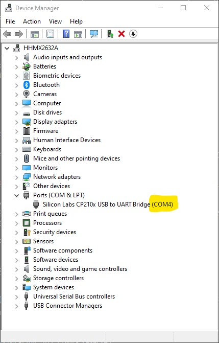

Oppitunnin aiheet:

1. MicroPythonin asentaminen ESP32-mikrokontrolleriin.
1. Koodin siirtäminen mikrokontrolleriin Ampy- tai Pymakr-työkalulla.
1. MicroPytonin standardikirjaston käyttäminen
1. Lämpötilasensorin lukeminen
1. Ledin vilkuttaminen


## What is MicroPython?

[What is Micropython?](https://pythonforundergradengineers.com/what-is-micropython.html)

## Let's Get Started!

<iframe width="560" height="315" src="https://www.youtube.com/embed/QopRAwUP5ds" title="YouTube video player" frameborder="0" allow="accelerometer; autoplay; clipboard-write; encrypted-media; gyroscope; picture-in-picture" allowfullscreen></iframe>


## Firmware-tutoriaali

[How to install MicroPython on an ESP32 microcontroller](https://pythonforundergradengineers.com/how-to-install-micropython-on-an-esp32.html)


## Pycom tutorials

[https://core-electronics.com.au/tutorials/pycom/](https://core-electronics.com.au/tutorials/pycom/)


[https://www.youtube.com/watch?v=HXOok3mfMLM](https://www.youtube.com/watch?v=HXOok3mfMLM)


## MicroPythonin asentaminen

Heikki Hietalan erinomaiset oppaat ja esimerkit:

1. [https://www.sabulo.com/sb/arduino/moving-on-from-arduino-to-esp32-part1/](https://www.sabulo.com/sb/arduino/moving-on-from-arduino-to-esp32-part1/)
1. [http://www.sabulo.com/sb/arduino/moving-on-from-arduino-to-esp32-part-2-micropython/](http://www.sabulo.com/sb/arduino/moving-on-from-arduino-to-esp32-part-2-micropython/)
1. [https://www.sabulo.com/sb/arduino/moving-on-from-arduino-to-esp32-part-3-upycraft-and-blink/](https://www.sabulo.com/sb/arduino/moving-on-from-arduino-to-esp32-part-3-upycraft-and-blink/)

## Esptool-työkalun asennus

```
> py -m pip install --upgrade pip --user
> pip install esptool
```

Huom! ESP32 CAM -laitteella firmwareasennus tulee tehdä IO0-pinnin ollessa kytkettynä maahan. Asennuksen jälkeen IO0 pitää irrottaa.

Firmwaren lataus: [https://micropython.org/download/esp32/](https://micropython.org/download/esp32/). Tallenna itsellesi firmware-tiedosto, joka on muodossa `esp32-idf4-vvvvkkpp-vX.YZ.bin`.

Tarkista järjestelmäsi asetuksista ESP32:n käyttämän COM-portin numero:



Tämän jälkeen voit asentaa firmwaren komentorivillä seuraavilla komennoilla (muuta COM4-portin tilalle oma COM-porttisi).

### erase_flash

`py -m esptool --chip esp32 --port COM4 erase_flash`

Muuta komennossa COM4-portin tilalle oma COM-porttisi.

```terminal
> py -m esptool --chip esp32 --port COM4 erase_flash

esptool.py v3.0
Serial port COM4
Connecting....
Chip is ESP32-D0WDQ6 (revision 1)
Features: WiFi, BT, Dual Core, 240MHz, VRef calibration in efuse, Coding Scheme None
Crystal is 40MHz
MAC: 8c:aa:b5:8b:fa:40
Uploading stub...
Running stub...
Stub running...
Erasing flash (this may take a while)...
Chip erase completed successfully in 7.3s
Hard resetting via RTS pin...
```


### write_flash

`py -m esptool --chip esp32 --port COM4 --baud 460800 write_flash -z 0x1000 esp32-idf4-20210202-v1.14.bin`

```terminal
> py -m esptool --chip esp32 --port COM4 --baud 460800 write_flash -z 0x1000 esp32-idf4-20210202-v1.14.bin

esptool.py v3.0
Serial port COM4
Connecting.....
Chip is ESP32-D0WDQ6 (revision 1)
Features: WiFi, BT, Dual Core, 240MHz, VRef calibration in efuse, Coding Scheme None
WARNING: Detected crystal freq 41.01MHz is quite different to normalized freq 40MHz. Unsupported crystal in use?
Crystal is 40MHz
MAC: 8c:aa:b5:8b:fa:40
Uploading stub...
Running stub...
Stub running...
Changing baud rate to 460800
Changed.
Configuring flash size...
Compressed 1484624 bytes to 951640...
Wrote 1484624 bytes (951640 compressed) at 0x00001000 in 22.0 seconds (effective 539.0 kbit/s)...
Hash of data verified.

Leaving...
Hard resetting via RTS pin...
```


### Putty-yhteyden testaus

Katso Heikki Hietalan kirjoittama ohje tekstiyhteyden muodostamiseksi Putty-sovelluksella osoitteessa [http://www.sabulo.com/sb/arduino/moving-on-from-arduino-to-esp32-part-2-micropython/](http://www.sabulo.com/sb/arduino/moving-on-from-arduino-to-esp32-part-2-micropython/).

```
ets Jun  8 2016 00:22:57

rst:0x1 (POWERON_RESET),boot:0x13 (SPI_FAST_FLASH_BOOT)
configsip: 0, SPIWP:0xee
clk_drv:0x00,q_drv:0x00,d_drv:0x00,cs0_drv:0x00,hd_drv:0x00,wp_drv:0x00
mode:DIO, clock div:2
load:0x3fff0018,len:4
load:0x3fff001c,len:5148
load:0x40078000,len:12880
load:0x40080400,len:3484
entry 0x40080630
MicroPython v1.14 on 2021-02-02; ESP32 module with ESP32
Type "help()" for more information.
>>>
```


### Ohjelmien siirtäminen mikrokontrolleriin

Edellä esitetty interaktiivinen tulkki toimii komentojen kokeilemisessa. Saadaksesi ohjelmia asennettua pysyvästi mikrokontrolleriin, lähdekooditiedostot täytyy siirtää mikrokontrollerin flash-muistiin.

MicroPython-ohjelmat voidaan siirtää tietokoneelta mikrokontrolleriin useilla eri työkaluilla.

Tällä kurssilla hyödynnämme [Ampy-työkalua](https://github.com/scientifichackers/ampy).

Toinen varteenotettava vaihtoehto on asentaa VS Code -työkaluun ja [Pycom](https://pycom.io/):in kehittämä Pymakr-laajennos.

Pymakr-laajennuksen käyttöohjeet löytyvät osoitteesta [https://docs.pycom.io/gettingstarted/software/vscode/](https://docs.pycom.io/gettingstarted/software/vscode/) ja itse laajennus voidaan asentaa VS Coden sovelluskaupasta: [https://marketplace.visualstudio.com/items?itemName=pycom.Pymakr](https://marketplace.visualstudio.com/items?itemName=pycom.Pymakr).


### Video: MicroPython Basics: Load Files & Run Code with Tony D!

<iframe width="560" height="315" src="https://www.youtube.com/embed/hrjtAYMrxF4" title="YouTube video player" frameborder="0" allow="accelerometer; autoplay; clipboard-write; encrypted-media; gyroscope; picture-in-picture" allowfullscreen></iframe>

Videon oheislukemisto: [https://learn.adafruit.com/micropython-basics-load-files-and-run-code](https://learn.adafruit.com/micropython-basics-load-files-and-run-code)

### Ampy - Adafruit MicroPython Tool


> *"Ampy is meant to be a simple command line tool to manipulate files and run code on a CircuitPython or MicroPython board over its serial connection. With ampy you can send files from your computer to the board's file system, download files from a board to your computer, and even send a Python script to a board to be executed."*
>
> [https://github.com/scientifichackers/ampy](https://github.com/scientifichackers/ampy)

Ampy-työkalun asennukseen tarvitset Pythonin venv-virtuaaliympäristön.

```terminal
> py -m venv .
> .\Scripts\Activate.ps1
```

Lisätietoja virtuaaliympäristöstä ja venv-työkalusta löydät Pythonin dokumentaatiosta [https://docs.python.org/3/library/venv.html](https://docs.python.org/3/library/venv.html).

Tämän jälkeen Ampy-työkalu voidaan asentaa seuraavasti:

```terminal
> py -m pip install adafruit-ampy
```

Kokeile lopuksi suorittaa uusi `ampy`-komento seuraavasti:

```terminal
> ampy --help
```

#### Tiedostojen listaaminen: `ls`

Muuta seuraavassa komennossa COM4-portin tilalle oma COM-porttisi:

```terminal
> ampy -p COM4 ls
/boot.py
```

#### Valinnainen: COM-portin tallentaminen

Voit tallentaa käyttämäsi asetukset, kuten COM-portin, erilliseen asetustiedostoon [Ampy-työkalun dokumentaation mukaisesti](https://github.com/scientifichackers/ampy#configuration).

Luo joko samaan hakemistoon, jossa annat komennot, tai vaihtoehtoisesti kotihakemistoosi tiedosto nimeltä `.ampy`. Lisää tiedostoon seuraava rivi (muuta tilalle oma COM-porttisi):

```
AMPY_PORT=COM4
```

Nyt voit jatkossa jättää `-p` tai `--port` parametrin pois käyttäessäsi `ampy`-komentoa.

#### Tiedostojen lataaminen: `get`

Voit tarkastella muistissa olevia tiedostoja get-komennolla:

```terminal
> ampy -p COM4 get boot.py
# This file is executed on every boot (including wake-boot from deepsleep)
#import esp
#esp.osdebug(None)
#import webrepl
#webrepl.start()
```

Get ei automaattisesti tallenna tiedostoa, vaan voit halutessasi tallentaa tiedoston paikalliseen hakemistoon kirjoittamalla komennon loppuun nimen, jolla haluat tallentaa tiedoston:

```terminal
> ampy -p COM4 get boot.py boot.py
```

Yllä olevassa esimerkissä tallennamme flash-muistissa olevan `boot.py`-tiedoston nykyiseen hakemistoon samalla nimellä.

#### Tiedoston suorittaminen

```terminal
> ampy run testi.py
```

#### Tiedostojen lähettäminen: `put`

Voit tehdä `boot.py`-tiedostoon muutoksia ja siirtää päivitetyn tiedoston muistiin `put`-komennolla:

```terminal
> ampy -p COM4 put boot.py
```

Tiedoston siirtäminen muistiin ei automaattisesti aiheuta ohjelman uudelleenkäynnistystä, joten koodiin tekemäsi muutokset eivät tule heti voimaan.

#### Uudelleenkäynnistys

```terminal
> ampy -p COM4 reset
```

#### Muut komennot

Lisää tietoa ampy-työkalun komennoista löydät esimerkiksi [Adafruitin artikkelista](https://learn.adafruit.com/micropython-basics-load-files-and-run-code/file-operations).


## ESP32:n tiedostojärjestelmän käyttäminen MicroPythonilla

[https://docs.micropython.org/en/latest/reference/filesystem.html](https://docs.micropython.org/en/latest/reference/filesystem.html)

#### Yleisiä ongelmatilanteita

**UnicodeDecodeError: 'utf-8' codec can't decode byte 0xff in position 0: invalid start byte**

Tiedoston enkoodaus ei ole UTF-8 merkistön mukaista. Käytä editorina ainoastaan VS Codea tai vastaavaa ohjelmistokehitykseen tarkoitettua työkalua.

**ampy.pyboard.PyboardError: failed to access COM4**

Voit olla kerrallaan vain yhdessä sarjaporttiyhteydessä yhden portin kautta. Sulje Putty ja mahdolliset muut käynnissä olevat ohjelmat, jotka käyttävät sarjaporttia.

### Lisätietoja

Hyvä tutoriaali: [How to upload .py-files onto an ESP8266 running MicroPython](https://pythonforundergradengineers.com/upload-py-files-to-esp8266-running-micropython.html)


## Extra: Arduino IDE:n käyttöönotto (draft, ESP32 CAM)

Arduino IDE:n asennus Windows storen kautta: [https://www.microsoft.com/fi-fi/p/arduino-ide/9nblggh4rsd8](https://www.microsoft.com/fi-fi/p/arduino-ide/9nblggh4rsd8)

Yhdistäminen: [https://randomnerdtutorials.com/program-upload-code-esp32-cam/](https://randomnerdtutorials.com/program-upload-code-esp32-cam/)

Arduino IDE:n käyttöönotto:
[https://randomnerdtutorials.com/installing-the-esp32-board-in-arduino-ide-windows-instructions/](https://randomnerdtutorials.com/installing-the-esp32-board-in-arduino-ide-windows-instructions/)

Asetustiedoston osoite: 

```
https://dl.espressif.com/dl/package_esp32_index.json
```

Lähdekoodien korjaus (compilation terminated -virhe) [https://forum.arduino.cc/index.php?topic=577858.0](https://forum.arduino.cc/index.php?topic=577858.0)


