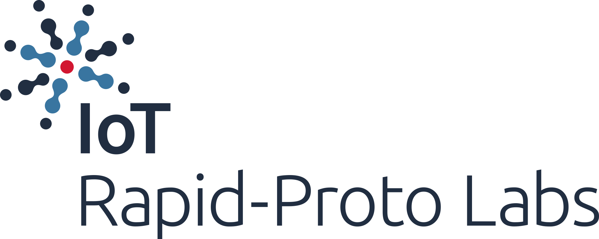

# Tervetuloa kurssille! 

    Tämä sivusto on Python-ohjelmointikurssin työversio. Kurssi ei ole tällä hetkellä suoritettavissa.

Tämä kurssi kestää 16 viikkoa ja se sisältää viikoittain 3 tuntia yhteistä opiskelua sekä noin 5 tuntia itsenäistä opiskelua. Käymme jokaisella viikolla yhteisesti läpi yhden uuden aiheen teoriaosuuden, jota sovelletaan viikoittain palautettavissa koodausharjoituksissa.

Osallistuaksesi kurssille sinulla tulee olla suoritettuna ohjelmistotuotannon orientaatiokurssi, tai vastaavat tiedot ja taidot. Aikaisempi kokemus Pythonista tai IoT:stä ei ole tarpeen.

Kurssin suoritettuasi sinulla on vankka käsitys Python-ohjelmointikielestä ja sen standardikirjastosta. Osaat toteuttaa sekä komentorivillä että mikrokontrollereilla suoritettavia pieniä ohjelmia, ja ymmärrät mikrokontrollerien keskeiset käsitteet. Osaat hyödyntää työskentelysi tukena ohjelmistokehityksen tukitoimia, kuten yksikkötestausta.

## Suositeltavat oppimateriaalit

Tällä kurssisivulla sijaitsevat oppimateriaalit on tarkoitettu ensisijaisesti oppituntien tueksi, eivätkä ne riitä pääasialliseksi Python-materiaaliksi kurssilla. Laajempia ja laadukkaita oppimateriaaleja löytyy mm. seuraavista lähteistä:

* Lappeenrannan Yliopiston Python 3 –ohjelmointiopas: [https://lutpub.lut.fi/handle/10024/162088](https://lutpub.lut.fi/handle/10024/162088)
* Pythonin oma "The Python Tutorial": [https://docs.python.org/3/tutorial/](https://docs.python.org/3/tutorial/)
* Mooc.fi:n Ohjelmoinnin perusteet -kurssi: [https://ohjelmointi-21.mooc.fi/](https://ohjelmointi-21.mooc.fi/)
* Codecademy:n "Learn Python 3" -kurssi: [https://www.codecademy.com/courses/learn-python-3/](https://www.codecademy.com/courses/learn-python-3/)

Jos haluat päästä nopeasti vauhtiin, voit lukea esimerkiksi tutoriaalin ["Learn Python in 10 minutes"](https://www.stavros.io/tutorials/python/) tai tutustua [Cheat sheet -muistiinpanoihin](https://www.pythoncheatsheet.org/).

Lisää hyvä lähteitä löydät hakukoneilla. Jaathan vinkkejä hyvistä materiaaleista myös kurssin Teamsissa!

&nbsp;

---

&nbsp;

Tämän kurssin IoT-osuus on toteutettu osana  Erasmus+ -rahoitettua [IoT Rapid-Proto labs](https://www.rapidprotolabs.eu/)-hanketta.

 

Disclaimer: "The European Commission's support for the production of this publication does not constitute an endorsement of the contents, which reflect the views only of the authors, and the Commission cannot be held responsible for any use which may be made of the information contained therein."